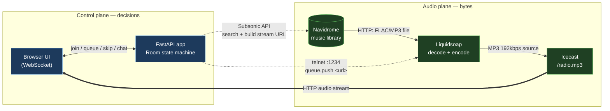
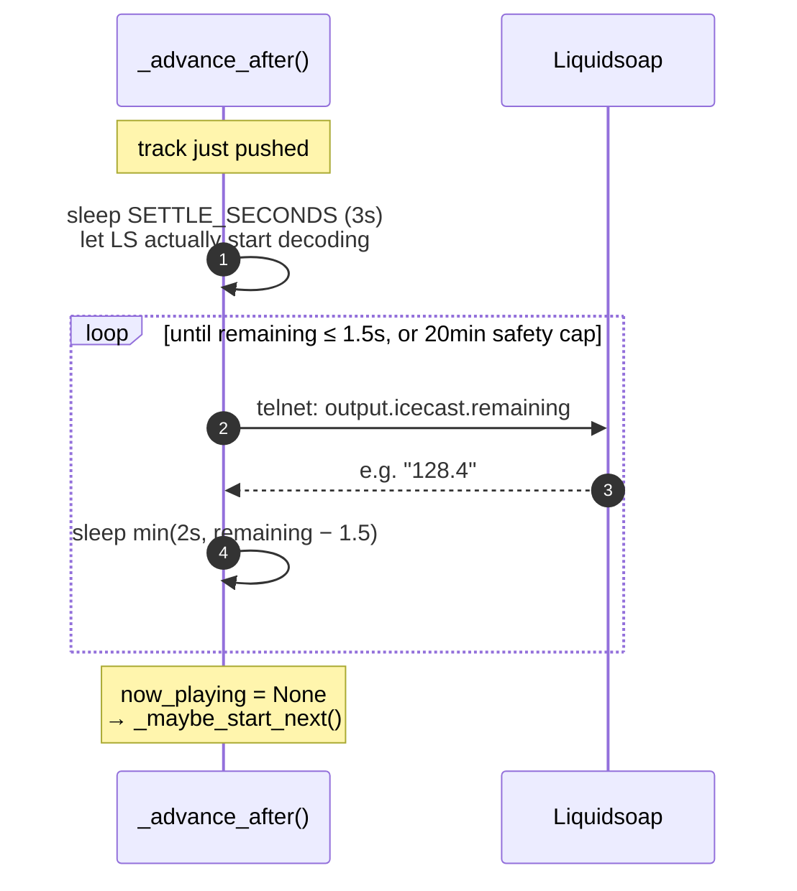
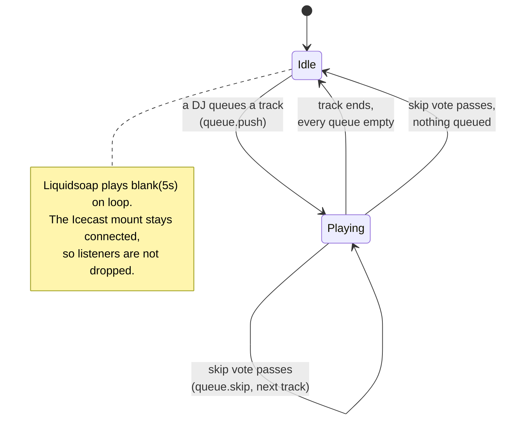
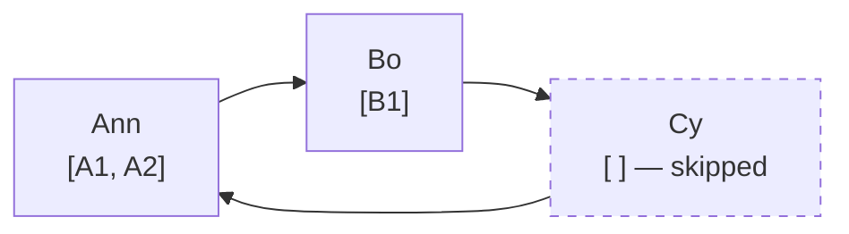
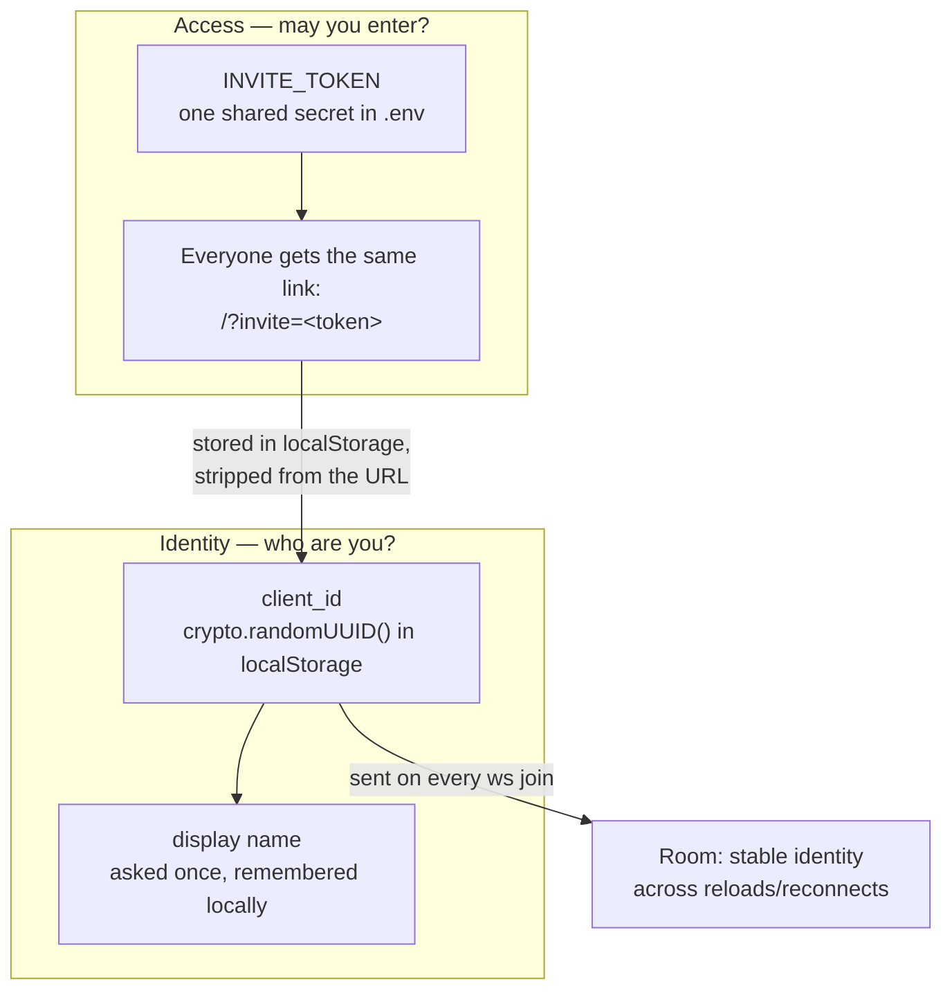
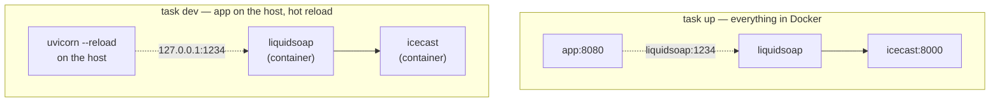

# tsdfm — architecture

A self-hosted, turntable.fm-style radio: friends take turns as DJ, queue tracks from a
private Navidrome library, and everyone hears the same broadcast in sync.

## The one idea that explains the whole design

**Audio never passes through the app.** The FastAPI app is a *control plane* — it decides
what should play and tells Liquidsoap to play it. The bytes go Navidrome → Liquidsoap →
Icecast → listeners, never touching the app.

This is why "everyone hears the same thing at the same second" is free: it isn't
per-client sync logic, it's one genuine live broadcast that many browsers tune into,
exactly like FM radio.



Solid arrows carry audio; dotted arrows carry control. Note the app has **no** solid
arrow — a useful sanity check when reasoning about a change.

## Components

| Piece | Role | Port |
|---|---|---|
| **app** (FastAPI) | Room state, DJ rotation, chat, invite auth, Navidrome search proxy | 8080 |
| **liquidsoap** | Fetches + decodes tracks, encodes one continuous MP3 stream | 1234 (telnet, localhost only) |
| **icecast** | Broadcasts that stream to listeners | 8000 |
| **navidrome** | The music library (external — you run it separately) | 4533 |

Liquidsoap's whole program is small enough to read at a glance:

```liquidsoap
queue  = request.queue(id="queue")          # we push one track at a time
silence = blank(duration=5.)                 # played when the queue runs dry
radio  = fallback(track_sensitive=false, [queue, silence])
output.icecast(%mp3(bitrate=192), mount="radio.mp3", ..., radio)
```

The `fallback` is what keeps the Icecast source connected during dead air — without it,
the mount would drop every time the queue emptied and every listener would be
disconnected.

## Getting a track on air

The app never hands Liquidsoap a file. It hands it a **signed Navidrome URL**, and
Liquidsoap fetches it directly.


Two things worth internalising:

- Step 8 (`state {now_playing}`) fires **before** Liquidsoap has actually started
  decoding. The UI is optimistic by a second or two; Icecast's own metadata is the
  ground truth about what is genuinely on air.
- The stream URL embeds Subsonic token auth (`t = md5(password + salt)`), so the raw
  Navidrome password is never in the URL — but the URL *is* a capability. It's only ever
  sent to Liquidsoap over the local network, never to browsers.

## Knowing when a track ended (the subtle part)

This is where the design earned its scars. The obvious approach — sleep for the track's
duration — is wrong, because the duration comes from Navidrome's file metadata, and a
mistagged file lies. When it lies short, the app declares "Nothing playing" while audio
is still going; the room appears to hang until someone hits skip.

The fix: ask Liquidsoap, which knows what it's actually decoding.



Design notes, each of which is a bug that was actually hit:

- **The settle delay is not cosmetic.** Poll immediately after a push and you may read
  the *previous* content's tail (or the 5s silence loop) and instantly conclude the new
  track is over.
- **`remaining() == None` means "unknown", not "finished".** A failed telnet read must
  retry, or a transient blip cuts a song short.
- **The safety cap must not be derived from the reported duration.** An earlier version
  capped the wait at `duration * 3`; with a duration of 5s against a real 201s track, it
  still cut off at 65s. The cap is now a flat 20 minutes whose only job is surviving a
  totally unreachable Liquidsoap.
- **Icecast's title is useless for this.** It only changes when *we* push something new,
  so waiting for it to change before pushing something new deadlocks. (It's still a fine
  read-only ground truth for "what is genuinely on air right now" — the e2e test uses it
  for exactly that.)

## Room state machine

All state is in-memory in the app process, so a restart wipes the queue and rotation
(the broadcast keeps playing — Liquidsoap and Icecast are untouched by an app restart).



### DJ rotation

Each DJ has their own queue; playback round-robins between DJs rather than draining one
person's queue first. A DJ with an empty queue is skipped rather than stalling the room.



Play order for the above: `A1 → B1 → A2 → …`

`current_dj_index` advances on each pick, so someone who queues mid-song slots into the
rotation rather than jumping the line.

## Identity and access

There are no accounts. Two separate concerns, deliberately not conflated:



Consequences worth knowing:

- A reload or dropped connection reconnects as the *same* person, so a disconnect
  deliberately does **not** drop you from the DJ rotation or wipe your queue. Only an
  explicit "step down" does that.
- Clearing browser data (or a different browser/device) makes you a new person who
  re-enters a name once. That's the honest cost of "no accounts, just a link".
- Revoking one person means rotating `INVITE_TOKEN` for everyone — the tradeoff of a
  single universal link.

## Deployment topologies



`task dev` is why Liquidsoap publishes its telnet port to `127.0.0.1` — a host process
needs to reach it. That port has **no authentication** (anyone who can reach it controls
the radio), which is why it is bound to loopback and never to `0.0.0.0`.

Because the app holds room state in memory, `task dev`'s hot reload wipes the queue on
every source edit. The audio keeps playing regardless.

## Configuration

All via `.env` (see `.env.example`):

| Variable | Used by | Notes |
|---|---|---|
| `NAVIDROME_URL` / `_USERNAME` / `_PASSWORD` | app | Your existing Navidrome; not managed by this stack |
| `INVITE_TOKEN` | app | The shared invite secret; `task invite` generates and prints the link |
| `ICECAST_STREAM_URL` | app → browser | Public URL the `<audio>` element points at |
| `ICECAST_SOURCE_PASSWORD` | icecast + liquidsoap | Must match on both sides or the mount never connects |
| `ICECAST_ADMIN_PASSWORD` / `_RELAY_PASSWORD` / `_HOSTNAME` | icecast | |
| `LIQUIDSOAP_HOST` / `_PORT` | app | `liquidsoap:1234` in Docker; `localhost:1234` for `task dev` |
| `APP_PUBLIC_URL` | `task invite` | Only so the invite link prints in full |

## Layout

```
app/                      uv project (src layout)
  pyproject.toml          deps + pytest config; `tsdfm-invite` console script
  src/tsdfm/
    main.py               FastAPI: HTTP + WebSocket, invite auth, log broadcast
    state.py              Room: rotation, queues, votes, advance loop
    navidrome.py          Subsonic client: search, stream/cover URLs
    liquidsoap_control.py telnet client: push / skip / remaining
    static/               the whole frontend (vanilla JS, no build step)
  tests/unit/             fast, no services
  tests/e2e/              needs a running stack
icecast/                  Dockerfile + config template
liquidsoap/               Dockerfile + radio.liq
docs/architecture.md      this file
```

## Testing

```bash
task test        # unit — Room logic, Navidrome client, telnet protocol (~6s)
task test:e2e    # e2e — needs a running stack; queues real tracks
task test:all
```

Unit tests fake Liquidsoap and Navidrome, and shrink the advance-loop timings via
monkeypatch, so the track-end logic that takes minutes in reality is verified in
milliseconds — including the regression where a wrong duration cut a track short.

The e2e suite drives the real WebSocket API and then **cross-checks Icecast's live
metadata**, so it fails if the app believes something is on air that isn't actually
being broadcast. It is disruptive by nature (it steps up as a DJ and queues tracks) —
run it against a dev stack, not during a listening session.
