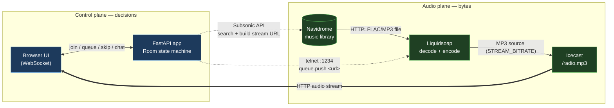
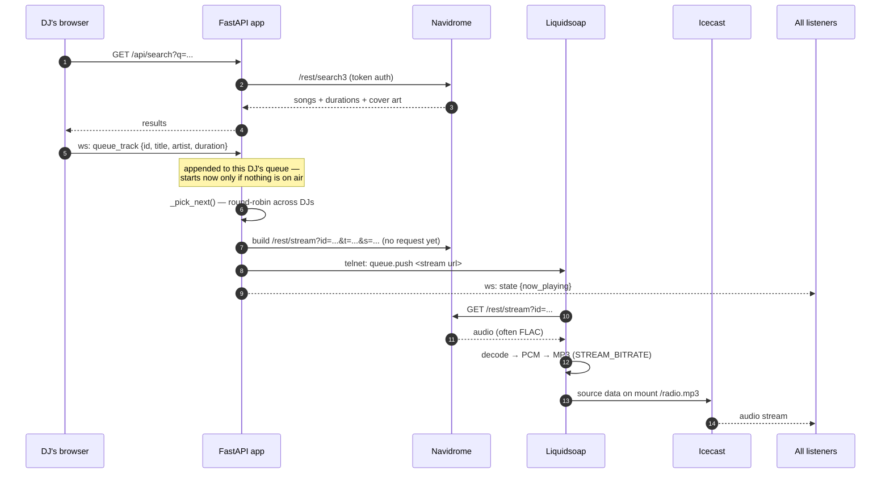
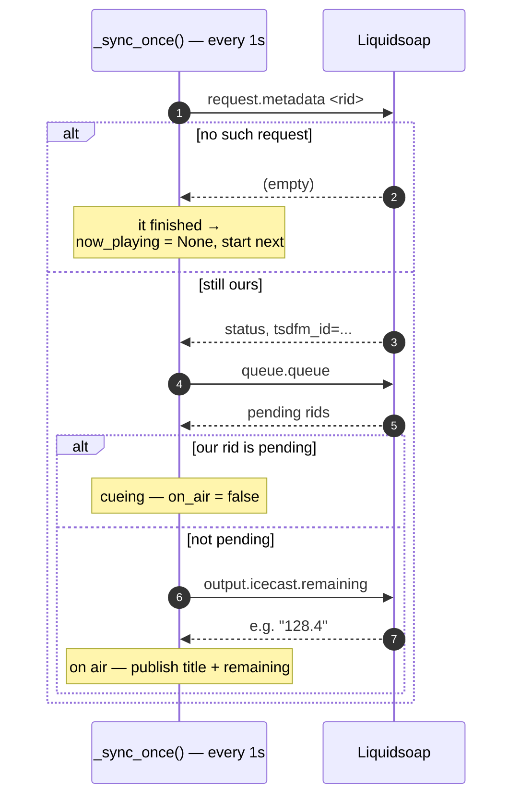
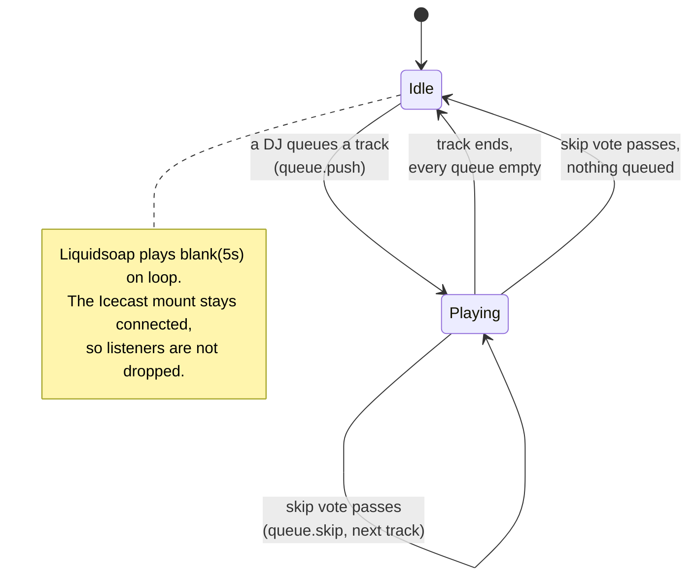
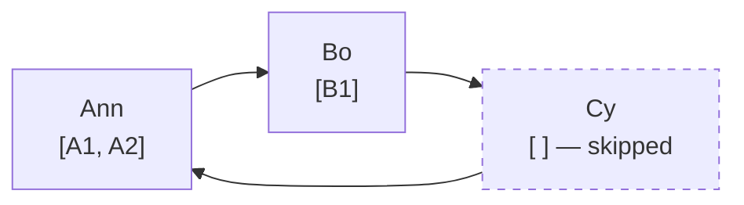
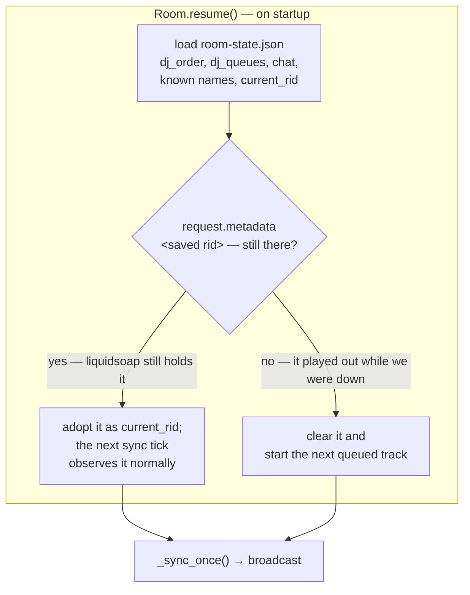
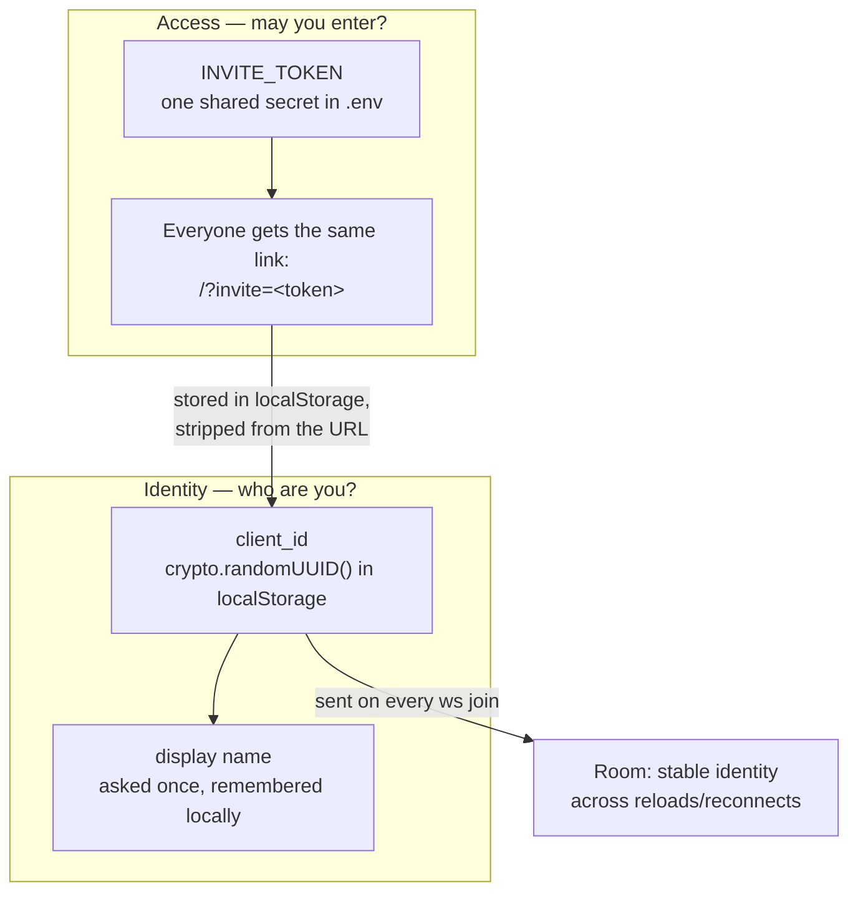
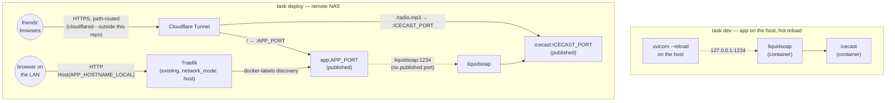

# tsdfm — architecture

A self-hosted, turntable.fm-style radio: friends take turns as DJ, queue tracks from a
private Navidrome library, and everyone hears the same broadcast in sync.

## The one idea that explains the whole design

**Audio never passes through the app.** The FastAPI app is a *control plane* — it decides
what should play and tells Liquidsoap to play it. The bytes go Navidrome → Liquidsoap →
Icecast → listeners, never touching the app.

This is why "everyone hears the same thing at the same second" is free: it isn't
per-client sync logic, it's one genuine live broadcast that many browsers tune into,
exactly like FM radio.



Solid arrows carry audio; dotted arrows carry control. Note the app has **no** solid
arrow — a useful sanity check when reasoning about a change.

Cover images are fetched separately through the app's `/api/cover-art?id=...` endpoint.
The app authenticates to Navidrome and returns the image with a one-hour private browser
cache. Browsers receive same-origin artwork URLs, never Navidrome credentials or LAN
addresses. Legacy artwork URLs in saved queues are converted when restored.

## Components

| Piece | Role | Port |
|---|---|---|
| **app** (FastAPI) | Room state, DJ rotation, chat, invite auth, Navidrome search proxy | 8080 (`task dev`/Dockerfile default; deploy overrides to `APP_PORT`, default 6490) |
| **liquidsoap** | Fetches + decodes tracks, encodes one continuous MP3 stream | 1234 (telnet, localhost only) |
| **icecast** | Broadcasts that stream to listeners | `ICECAST_PORT`, default 6491 |
| **navidrome** | The music library (external — you run it separately) | 4533 |

Liquidsoap's whole program is small enough to read at a glance:

```liquidsoap
queue  = request.queue(id="queue")          # we push one track at a time
silence = blank(duration=5.)                 # played when the queue runs dry
radio  = fallback(track_sensitive=false, [queue, silence])
bitrate = int_of_string(environment.get(default="320", "STREAM_BITRATE"))
output.icecast(%mp3(bitrate=bitrate), mount="radio.mp3", ..., radio)
```

The `fallback` is what keeps the Icecast source connected during dead air — without it,
the mount would drop every time the queue emptied and every listener would be
disconnected.

## Getting a track on air

The app never hands Liquidsoap a file. It hands it a **signed Navidrome URL**, and
Liquidsoap fetches it directly.



Two things worth internalising:

- Step 8 (`state {now_playing}`) reports the track as **cueing**, not playing. The app
  never claims something is on air until Liquidsoap says so — see
  [Knowing when a track ended](#knowing-when-a-track-ended-the-subtle-part).
- The stream URL embeds Subsonic token auth (`t = md5(password + salt)`), so the raw
  Navidrome password is never in the URL — but the URL *is* a capability. It's only ever
  sent to Liquidsoap over the local network, never to browsers.

## Knowing when a track ended (the subtle part)

This is where the design earned its scars, through three failed attempts:

1. **Sleep for the track's duration.** Wrong: duration comes from file tags, and a
   mistagged file lies. When it lies short the app announced "Nothing playing" while audio
   kept going, and the room appeared to hang until someone hit skip.
2. **Wait for Icecast's title to change.** Deadlocks: the title only changes when *we*
   push something new, so "wait for it to change before pushing" waits forever.
3. **Infer from `remaining()` alone.** `remaining()` reports whatever the *output* is
   playing — it never says *which request* that is. Just after a push it still describes
   the previous track's tail or the silence loop, so an early poll reads a number near
   zero and concludes the brand-new track is already over. The app then pushed the next
   one and ran a whole track ahead of the audio, permanently, because Liquidsoap's queue
   is FIFO and simply played them in order.

**The rule now: the app never infers playback state, it observes it.** Every push is
tagged with an id of our own via Liquidsoap's `annotate:` protocol, and three cheap reads
answer everything unambiguously:

| Observation | Meaning |
|---|---|
| our rid appears in `queue.queue` | cueing — accepted, not yet audible |
| our rid exists but is *not* in `queue.queue` | **on air** |
| `request.metadata <rid>` comes back empty | finished, or failed to resolve |
| `output.icecast.remaining` | seconds left, straight from the decoder |



Design notes, each of which is a bug that was actually hit:

- **`now_playing` is only ever written from an observation.** `_start_next()` hands a
  track to Liquidsoap and deliberately touches nothing else; the next tick discovers it.
  Every desync in this project's history came from writing that field optimistically.
- **"Couldn't ask" is not "nothing is there".** The control channel raises
  `LiquidsoapUnavailable` rather than returning an empty answer, and the sync loop holds
  its last known state when it fires. Conflating the two made a dropped socket read as
  "the track ended".
- **Exactly one request in flight.** Before pushing, `_start_next` drops anything already
  pending (`queue.remove`). Leftovers from a crashed process would otherwise play ahead of
  whatever the app starts next.
- **The countdown comes from Liquidsoap, never from `duration`.** Navidrome's duration is
  used for the progress bar's *total* only; if it's wrong, the bar is wrong but playback
  is still correct.
- **Metadata parsing must tolerate CRLF.** Liquidsoap's telnet terminates lines with
  `\r\n`; a regex anchored to `"$` silently matches nothing against the real server.

## Room state machine

State lives in memory in the app process and is mirrored to disk after every mutation
(see [Surviving a restart](#surviving-a-restart)), so a reload no longer costs anyone
their queue. The broadcast is unaffected either way — Liquidsoap and Icecast don't care
that the app restarted.



### DJ rotation

Each DJ has their own queue; playback round-robins between DJs rather than draining one
person's queue first. A DJ with an empty queue is skipped rather than stalling the room.



## Surviving a restart

`uvicorn --reload` restarts the app on every source edit, and redeploys do the same. The
audio never stops — but before persistence, the room did: queues, rotation and chat all
vanished, and the app went blind to a track that was still playing.

State is mirrored to a JSON file after every mutation, and rebuilt on startup.

The saved state includes the **request id** we were last driving, which is what makes
re-attaching exact rather than a guess.



Re-attaching matters as much as the queues: Liquidsoap kept broadcasting throughout, so
starting a fresh track on top of it would stack two songs. Note there is no arithmetic
here and no heuristic threshold — we ask about one specific request and believe the
answer, which is the same rule the sync loop follows.

**Why a file and not Redis.** The payload is a few KB, there is exactly one writer, and
nothing else reads it. Redis would add a container, a dependency and a failure mode — and
would still need a volume to survive its own restarts, so it doesn't even remove the disk.
A file stays inspectable with `cat` when something looks wrong.

**What concurrent writes do.** Nothing surprising, by construction rather than by luck:

- `_persist()` is a plain synchronous function with no `await` in it or in `save_state()`.
  The app is single-threaded asyncio, so once a save starts, no other coroutine runs until
  it finishes. Two "simultaneous" updates serialise into two complete sequential writes.
- Each write dumps the whole room as it exists at that instant — it is a projection of
  memory, not a read-modify-write — so last-write-wins is the correct outcome and there is
  no merge to get wrong.
- Writes go to a `mkstemp` file in the same directory and land via `os.replace`, an atomic
  rename. A reader never sees a partial file, and a crash mid-write leaves the previous
  file intact and loadable. A corrupt file is logged and ignored rather than taken as fatal.

**The real hazard is two processes.** Two app instances pointed at the same `STATE_PATH`
each hold an independent in-memory room and will clobber each other — every individual
write stays intact, but the loser's queue silently disappears. This is plausible during
development (`task dev` alongside a dockerized `app`), so the defaults keep them apart:
the dev server resolves `STATE_PATH` relative to its working directory, while the
container writes to its own volume. Point both at one path only if you mean to.

One accepted gap: during a reload the outgoing process can write after the incoming one
has already called `resume()`, so the very last mutation before a restart can be lost. It
self-corrects on the next mutation.

Play order for the above: `A1 → B1 → A2 → …`

`current_dj_index` advances on each pick, so someone who queues mid-song slots into the
rotation rather than jumping the line.

## Dancefloor and bar

The scene below On Air is a presentation component in `static/room-scene.js`,
with `room-scene.css` scoped inside a shadow root. `app.js` supplies room state
and action callbacks; the component has no sockets, audio processing, or playback
decisions. It renders connected users with their profile avatars. Keyed character
elements preserve animation across progress ticks and chat updates.

Authenticated `scene` WebSocket messages select a move (headbang, jumping, disco,
or seated) or order a drink. The server validates choices and stores them alongside
known identities, so they survive reconnects and restarts without changing DJ state.
Three connected people can sit at the bar. Disconnecting frees a stool; reconnecting
returns someone to the floor if the bar has filled up. Orders can still be collected
standing. Only choices are broadcast, never animation frames.

Optional Navidrome `bpm` metadata travels through search/album results, queues, and
on-air records. The scene uses it as an animation speed, falling back to 120 BPM when
unavailable. Dance timing remains independent of audio analysis. `audio-spectrum.js` captures
the existing browser media element into a separate Web Audio analyser. Its 22
logarithmic frequency bands drive the wall bars; measured RMS volume drives the
floor glow. Samples update only the scene spectrum renderer, at most 30 times per
second, without rebuilding characters or other UI.

The analyser never connects to an audio output and never changes the player's
source, volume, mute state, or network request. Capture requires browser support
(`captureStream` / `mozCaptureStream`) and origin-accessible audio; unsupported or
cross-origin streams retain a still visualizer and normal playback. It uses no
microphone and requests no media permissions. Analysis stops while muted, paused,
hidden, disconnected, in the library, or under reduced motion. A stream reload
detaches the old capture and attaches the new audio track.

 When the observed track is not on air, characters relax with a slow breathing
animation and the wall bars settle to a dim baseline. The bartender continues at
a leisurely pace. Animations pause when disconnected or viewing the library.
Scene surfaces, lighting, controls, and clothing inherit the selected app theme. Reduced-motion preferences disable all
scene animation. The Liquidsoap/Icecast control and audio paths are unchanged.

## Identity and access

There are no accounts. Two separate concerns, deliberately not conflated:



Consequences worth knowing:

- A reload or dropped connection reconnects as the *same* person, so a disconnect
  deliberately does **not** drop you from the DJ rotation or wipe your queue. Only an
  explicit "step down" does that.
- Clearing browser data (or a different browser/device) makes you a new person who
  re-enters a name once. That's the honest cost of "no accounts, just a link".
- Revoking one person means rotating `INVITE_TOKEN` for everyone — the tradeoff of a
  single universal link.

## Deployment topologies

`docker-compose.yml` holds only Icecast + Liquidsoap. The app never runs in local Docker —
it's either a host process (`task dev`) or, for the one place it *is* containerized, the
remote deploy, which layers `docker-compose.deploy.yml` on top to add it.



`task dev` is why Liquidsoap publishes its telnet port to `127.0.0.1` — a host process
needs to reach it. That port has **no authentication** (anyone who can reach it controls
the radio), which is why it is bound to loopback and never to `0.0.0.0`.

Because the app holds room state in memory, `task dev`'s hot reload wipes the queue on
every source edit. The audio keeps playing regardless.

**Two independent paths reach `app` in deploy, on purpose.** A LAN-only one through
Traefik (`web_local` entrypoint, plain HTTP, `APP_HOSTNAME_LOCAL`, no certresolver — the
same pattern [the traefik role](https://github.com/tsdaemon/theseus/tree/main/roles/services/traefik)
this was built against uses for internal-only dashboards like Portainer), and a public one
where a Cloudflare Tunnel (`cloudflared`, configured entirely outside this repo) terminates
TLS at Cloudflare's edge and forwards straight to `app`'s published port on the NAS,
bypassing Traefik. `APP_PUBLIC_URL` is whatever hostname that Tunnel presents — independent
of `APP_HOSTNAME_LOCAL`, which only has to resolve on the LAN.

**Why `app` and `icecast` both publish a host port, but `liquidsoap` doesn't.** The
Cloudflare Tunnel needs a real host port to forward to for each of `app` and `icecast` (it
can't discover containers the way Traefik does), and a natural Tunnel config routes both
under one public hostname by path — `/radio.mp3` to Icecast's port, everything else to the
app's — so browsers see one origin for both the UI and the stream, matching how
`ICECAST_STREAM_URL` already gets embedded straight into the page. `liquidsoap` never
needs one: nothing outside the compose network ever talks to it directly, `app` reaches it
by service name (`liquidsoap:1234`), same as Traefik reaching `app` by container IP rather
than a published port.

**Both ports are `${VAR:-default}` (`APP_PORT` defaulting to 6490, `ICECAST_PORT` to
6491)**, not the Dockerfile/icecast.xml defaults of 8080/8000, purely so they read as
distinct from other services' ports when eyeballing NAS-wide configs — nothing actually
collides either way, since Docker namespaces each container's ports separately regardless
of what's published. `ICECAST_PORT` also has to reach Liquidsoap (it connects to
`icecast:$ICECAST_PORT` internally) and Icecast's own `<listen-socket>`, so changing it
means setting the one env var, not editing three places by hand.

**Stream access is authenticated at Icecast.** The browser exchanges its invite via
`POST /api/session` for a signed HttpOnly cookie, valid for seven days and tied to the
current invite secret. `/api/search`, `/api/cover-art`, and `/api/logs` require that cookie.
`/api/stats` requires a separate `STATS_API_TOKEN` bearer token, scoped only to
that endpoint. Homepage sends it using its configured Authorization header. An unset
token denies access; neither an invite nor a browser session substitutes for this token. The frontend establishes a session before
requesting audio or private APIs.

For every new `/radio.mp3` listener, Icecast posts the Cookie header to the app's
`/api/stream-auth` endpoint. Missing, expired, or forged sessions are denied. If the app
is unavailable, new listeners are denied; existing connections keep playing. Audio
still travels directly from Icecast to browsers. Rotating the invite invalidates sessions
on subsequent requests; already connected streams require disconnection to revoke.

The stream and app must use the same browser hostname for the cookie to reach both.
Public deploy uses HTTPS and `/radio.mp3` on the app's hostname. For local development,
use the same hostname for port 8080 and port 6491 (for example localhost for both).
Icecast reaches the host app via `host.docker.internal:8080` in dev, and `app:APP_PORT`
in deploy. Do not expose another unauthenticated mount or relay.

`task test:auth` checks real Icecast/Liquidsoap in isolated local containers with test
credentials, including rejection when the authentication service is down. `task deploy:auth`
builds and recreates only app and Icecast, disconnecting existing listeners.

**The Homepage dashboard widget** (`homepage.widget.*` labels on `app`) polls
`GET /api/stats` over the LAN-local Traefik route — authenticated with the dedicated stats token. Its `connectedusers` field counts
connected room users; `listeners` is retained as a compatibility alias.

## Configuration

All via `.env` (see `.env.example`):

| Variable | Used by | Notes |
|---|---|---|
| `NAVIDROME_URL` / `_USERNAME` / `_PASSWORD` | app | Your existing Navidrome; not managed by this stack |
| `INVITE_TOKEN` | app | The shared invite secret; `task invite` generates and prints the link |
| `ICECAST_STREAM_URL` | app → browser | Public URL the `<audio>` element points at |
| `ICECAST_SOURCE_PASSWORD` | icecast + liquidsoap | Must match on both sides or the mount never connects |
| `ICECAST_ADMIN_PASSWORD` / `_RELAY_PASSWORD` / `_HOSTNAME` | icecast | |
| `LIQUIDSOAP_HOST` / `_PORT` | app | `liquidsoap:1234` in Docker; `localhost:1234` for `task dev` |
| `APP_PUBLIC_URL` | `task invite` / `task deploy:invite` | Only so the invite link prints in full - the *public*-facing URL, whatever fronts it |
| `APP_HOSTNAME` | `task deploy` only | LAN-local hostname Traefik routes to the app over plain HTTP; lives in `.env.deploy`, not `.env` |
| `DEPLOY_INVITE_TOKEN` | `task deploy` only | The deployed room's invite secret - a separate key from `INVITE_TOKEN` on purpose, see below |

`task deploy` reads `.env.deploy` instead of `.env` (see `.env.deploy.example`) — kept
separate so a local test setup and the real NAS's credentials/hostname never have to share
one file. `go-task` merges dotenv files rather than replacing, so `.env.deploy` only needs
to hold what's actually different from `.env`.

`DEPLOY_INVITE_TOKEN` is deliberately a different key than `.env`'s `INVITE_TOKEN` (mapped
onto the container's `INVITE_TOKEN` env var in `docker-compose.deploy.yml`), rather than
letting the deploy fall back to `.env`'s value when unset. Otherwise your local test room
and the real deployment would silently share one invite link - anyone you handed the dev
link to could join the real room, and rotating one would rotate both.

## Layout

```
app/                      uv project (src layout)
  pyproject.toml          deps + pytest config; `tsdfm-invite` console script
  src/tsdfm/
    main.py               FastAPI: HTTP + WebSocket, invite auth, log broadcast
    state.py              Room: rotation, queues, votes, advance loop
    navidrome.py          Subsonic client: search, stream/cover URLs
    liquidsoap_control.py telnet client: push / skip / remaining
    static/               the whole frontend (vanilla JS, no build step)
  tests/unit/             fast, no services
  tests/e2e/              needs a running stack
icecast/                  Dockerfile + config template
liquidsoap/               Dockerfile + radio.liq
docker-compose.yml        icecast + liquidsoap — used by task dev, and as the base for deploy
docker-compose.deploy.yml overlay: adds app + Traefik/Homepage labels — used by task deploy
docs/architecture.md      this file
```

## Testing

```bash
task test        # unit — Room logic, Navidrome client, telnet protocol (~6s)
task test:e2e    # e2e — needs a running stack; queues real tracks
task test:all
```

Unit tests fake Liquidsoap and Navidrome, and shrink the advance-loop timings via
monkeypatch, so the track-end logic that takes minutes in reality is verified in
milliseconds — including the regression where a wrong duration cut a track short.

The e2e suite drives the real WebSocket API and then **cross-checks Icecast's live
metadata**, so it fails if the app believes something is on air that isn't actually
being broadcast. It is disruptive by nature (it steps up as a DJ and queues tracks) —
run it against a dev stack, not during a listening session.
